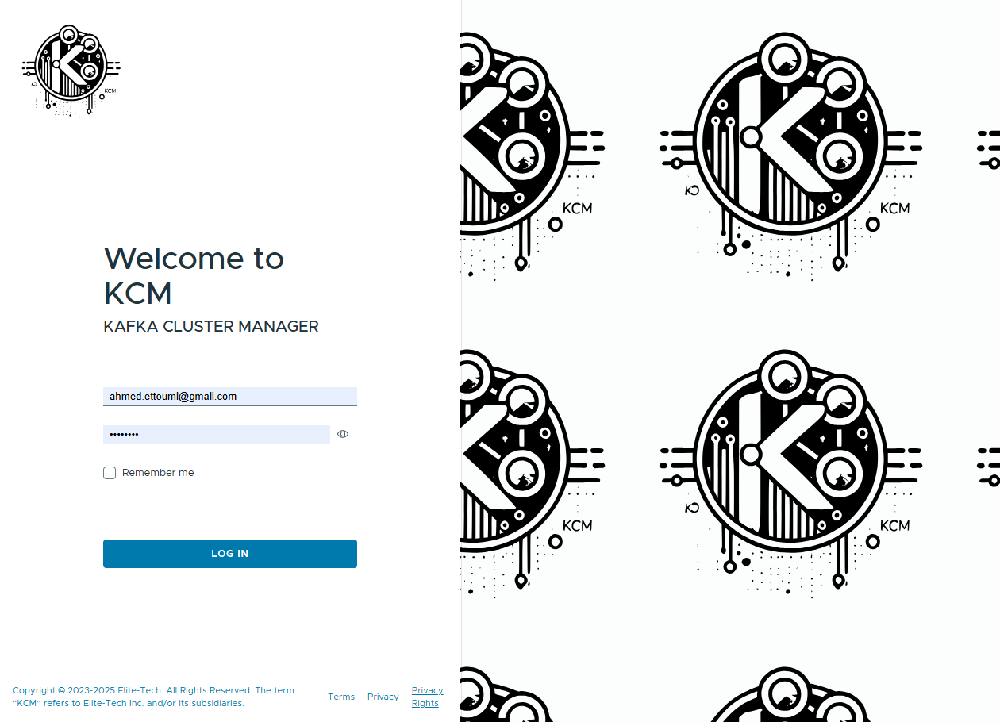
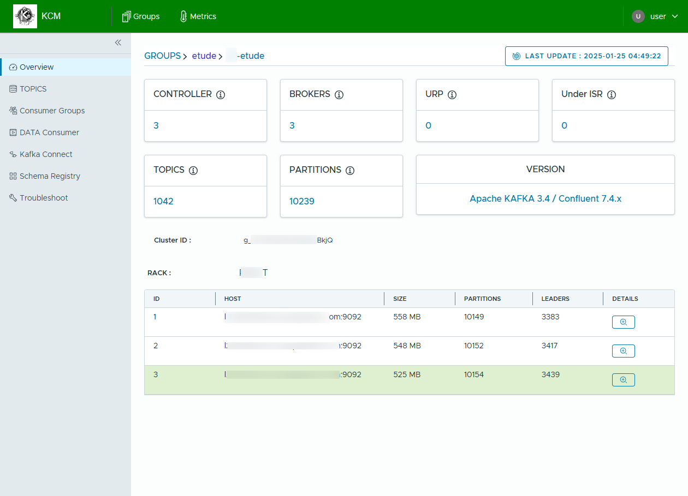

# kcm

To start KCM in local, use:

### 1 Install Docker and Docker Compose <br />
Follow instruction here https://docs.docker.com/engine/install/ <br />

Or you could use Podman and Podman Compose <br />
Follow instruction here https://podman.io/docs/installation <br />

### 2 Clone the repository <br />
```shell
git clone git@github.com:ahmedtoumi/kcm.git
cd kcm
```

### 3 Start the application <br />

#### 3.1 If you need a local kafka cluster, you can use the docker-compose file in the [samples/kcm-with-local-brokers](samples/kcm-with-local-brokers/docker-compose.yml) folder <br />.

```shell
docker compose -f samples/kcm-with-local-brokers/docker-compose.yml up -d
```
Or 
```shell
podman compose -f samples/kcm-with-local-brokers/docker-compose.yml up -d
```

#### 3.2 If you already have a kafka cluster, you can use the docker-compose file in the [samples/kcm-starter](samples/kcm-starter/docker-compose.yml) folder <br />.

```shell
docker compose -f samples/kcm-starter/docker-compose.yml up -d
```
OR
```shell
podman compose -f samples/kcm-starter/docker-compose.yml up -d
```

### 4 Start the application <br />

open [localhost](http://localhost) and enjoy your new experience with KAFKA

Default Credentials: <br />

> **LOGIN**: user <br />
**PASSWORD**: password





### Check the Milestones and the Roadmap [here](https://github.com/ahmedtoumi/kcm/milestones?state=closed)